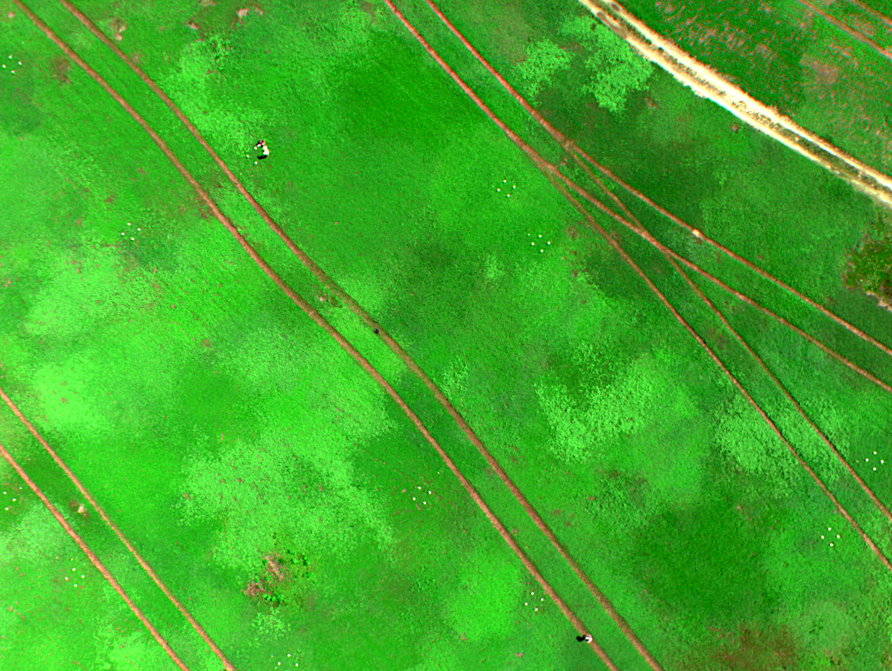
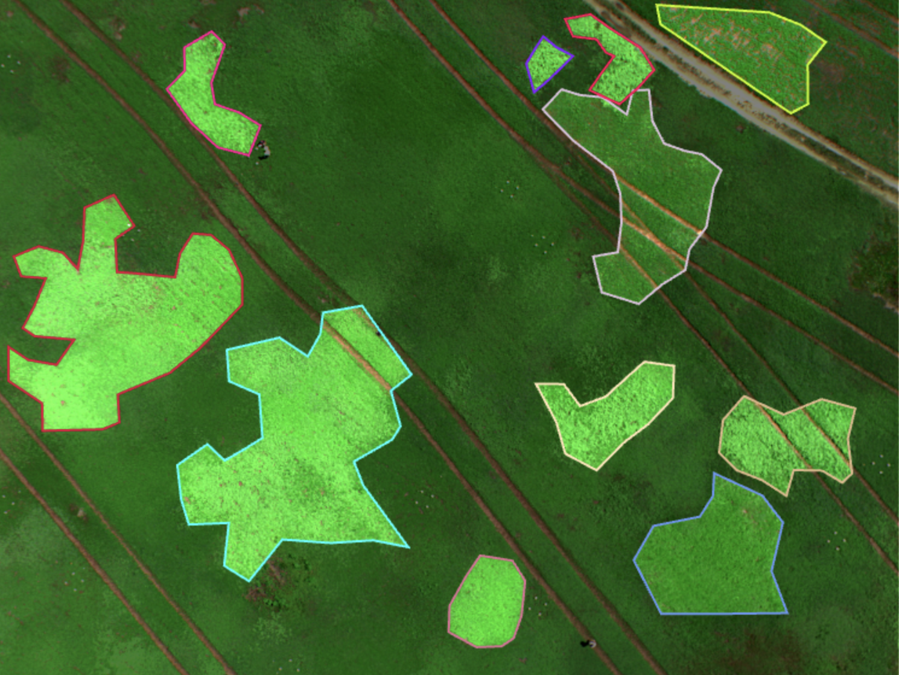

# RA---Seaqueue-Qian-Cheng

_Multi-Spectral Image (MSI) Segmentation:_

The objective of this project is to analyze multispectral data using advanced models like YOLO11 or Segment Anything Model(SAM). By segmenting multispectral images using such models, we can accurately assess crop health, identifying areas that are healthy, water-deficient, or lacking essential nutrients.​

  
  

Multispectral imaging (MSI) is a powerful technique that captures detailed spectral information across numerous wavelengths, enabling the identification and differentiation of materials based on their chemical compositions. In agriculture, MSI serves as a unique signature to assess crop health by detecting specific spectral reflectance patterns associated with various plant conditions. For instance, changes in a plant's Chlorophyll due to stress or disease produce distinct spectral signatures, which can be detected through multispectral imaging.

In summary, integrating multispectral imaging with state-of-the-art models enhances our ability to monitor and manage crop health effectively, leading to more informed agricultural practices and improved crop yields.
